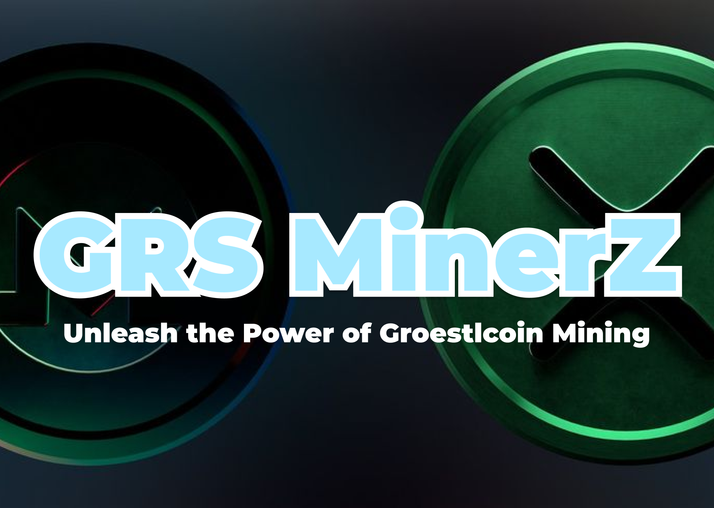

# ✨GRS MinerZ✨ - Unleash the Power of Groestlcoin Mining! 🚀

GRS MinerZ is an expertly crafted, open-source mining application meticulously designed to extract maximum performance from your hardware when mining Groestlcoin (GRS) using the highly efficient Groestl algorithm. 🔥 Built for speed, stability, and optimal resource utilization, GRS MinerZ delivers unparalleled hashing power on both CPU and GPU platforms! 💎

  <!-- Add your logo here.  Remove this line if you don't want a logo. -->

## ✨ Features

🌟 Key Features to Maximize Your GRS Rewards: 🌟

*   🎯 Groestl Algorithm Optimization: GRS MinerZ is exclusively optimized for the Groestl algorithm, ensuring peak performance and profitability for mining Groestlcoin. 🏆
*   💪 Harness CPU & GPU Capabilities: Experience finely tuned mining paths for both modern CPUs and AMD/NVIDIA GPUs, pushing your hardware to its absolute limits! 💻 ➡️ ⛏️
*   ⚡ Blazing Fast Performance:  Leveraging optimized code and hardware-specific tuning, GRS MinerZ delivers exceptionally high hash rates on compatible devices. 💨
*   💰 Energy-Conscious Mining: Engineered for reduced power consumption 💡, increasing your ROI while minimizing your impact on the environment. 🌎
*   🚀 Simple Setup: Our streamlined command-line interface allows you to begin mining in minutes!  Configure, connect, and start earning! 💨
*   🛡️ Resilient Pool Management: Seamlessly connect to multiple mining pools for enhanced reliability and increased uptime. 🤝
*   🧠 Smart Hardware Detection: GRS MinerZ automatically detects your hardware 🕵️ and dynamically adjusts configurations to achieve optimal performance. 💯
*   🪨 Rock-Solid Stability: Extensively tested to ensure continuous and dependable operation. ⏱️ Enjoy uninterrupted mining with zero crashes!
*   📜 Open Source & Transparent: Fully open-source codebase ensures verifiable security and promotes community collaboration.  👀 Contributions are always welcome! 🫂
*   🔄 Dedicated Development: Our dedicated team is constantly refining and improving GRS MinerZ with regular updates and performance enhancements! 🚀

## ⬇️ Installation

⛏️ Get Started Mining Groestlcoin in Just 4 Steps: ⛏️

1.  Download the latest release from "releases/GRSMinerZ.zip" ⬇️
2.  Extract the archive to your preferred location. 📁
3.  Execute the miner grsminerz or grsminerz.exe (depending on your operating system). 💻
4.  Edit the config.txt file with your pool and wallet information. 📝

## ⚙️ Configuration

🔧 Configuration Parameters (in config.txt): 🔧

*   algorithm: "groestl"
*   pool_url: "stratum+tcp://grs.pool.example.com:3333"
*   wallet_address: "YourGroestlcoinWalletAddress"
*   threads: "4" (Number of CPU threads to use - optional)
*   gpu_devices: "0,1" (Comma-separated list of GPU device IDs - optional)
*   intensity: "12" (GPU intensity, adjust for optimal performance - optional)

---

⚠️ Disclaimer: GRS MinerZ is provided as-is, without any warranty.  Mining cryptocurrencies carries inherent financial risk.  Use at your own risk. The developers are not responsible for any financial losses. Please ensure compliance with all applicable laws and regulations.

---

*Inspired by the principles of open-source mining software. Thank you to the open-source community!*
